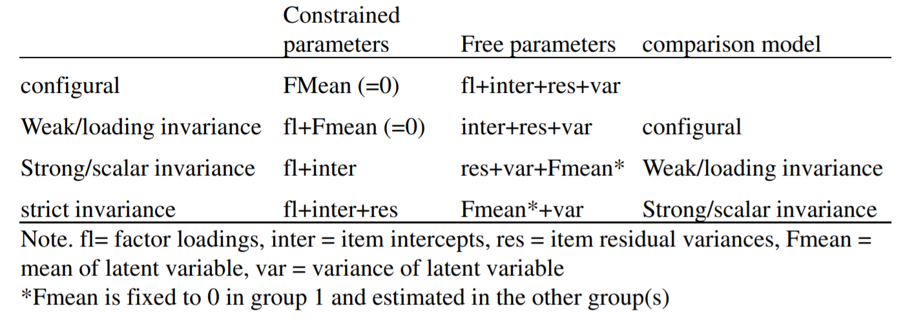

```{r setup, include = FALSE}
library("papaja")
r_refs("r-references.bib")
```

```{r analysis-preferences}
# Seed for random number generation
set.seed(42)
knitr::opts_chunk$set(cache.extra = knitr::rand_seed, echo=FALSE, warning=FALSE, message=FALSE)
```

Initially we were interested in looking at reliance on student samples. Now we are evaluating the psychometric properties of the dirty dozen (DD) simplified Chinese version by using samples in real settings: job applicants and incumbents (in addition to students). We replicate a previous study using the student sample (Yang gonna send some articles), then continue to evaluate with organizational data. We find that the scales are non-invariant. 

SDSME another version (27 items).

All studies investigating psychometric properties of these scales use University students. 

Some groups may be expected to exhibit different item-construct associations due to shifting motivational forces. 

ITC guidlines for translating and adapting tests recommends looking at possible differences across motives [@itc_2017]. For example, 

Yang's references: @church2011cross, @vandevelopmetrics, @schmitt2008measurement, @geng2015dirty, @grigoras2020measurement, @jonason2010dirty

# Methods

We applied three different nested multiple group confirmatory factor analysis models progressing through levels of restriction. These invariance tests were evaluations of configural-, weak-, and finally strict-invariance. The weak invariance models constrained factor loadings to be equal across groups and the strong invariance models also constrained intercepts to be equal across groups. We also look at intercorrelations among items within the samplings. We use the methodology of @grigoras2020measurement

```{r readingdata}

library(foreign)
library(careless)

## A30-A41 are Dirty Dozen
## A42-A57 are Hexico Honesty-Humility
## within the HH scale there are subscales (identified in "67624 research items update.xlsx)

masterdata <- read.spss("Dirty Dozon data for SIOP.sav")
tempdata <- data.frame(masterdata)                           ## Yang other variables
DDdata <- data.frame(masterdata[c(1:3,34:45)])

table <- descr::freq(DDdata$selection, plot=FALSE)
dtable <- cbind(sample = rownames(table), table) ## to call out in paper


####################################### data screening below

careless_long <- longstring(DDdata[4:15])
careless_irv <- irv(DDdata[4:15])

careless_long <- data.frame(careless_long)
careless_irv  <- data.frame(careless_irv)

DDdata <- cbind(DDdata, careless_long, careless_irv)

#descr::freq(DDdata$careless_long)
#descr::freq(DDdata$careless_irv)

use <- DDdata[ which(DDdata$careless_long<7), ]


```

## Participants

In total `r nrow(DDdata)` individuals responded to the Dirty Dozen (as well as additional scales not the focus of the current presentation). This total was comprised of `r dtable[1,2]` `r dtable[1,1]`, `r dtable[2,2]` `r dtable[2,1]`, and `r dtable[3,2]` `r dtable[3,1]` individuals. After screening for undifferentiated responses via the `R` package `careless` [@R-careless], we retained `r nrow(use)` respondents who had no more than 6 sequentially identical responses across the 12 total items.

```{r alphas}

library(psych)
mach   <- alpha(use[c(4,7,10,13)])
psycho <- alpha(use[c(5,8,11,14)])
narci  <- alpha(use[c(6,9,12,15)])

```

## Materials

Dirty dozen version XX. Coefficiant alphas for the scales were `r round(mach$total$raw_alpha,2)` (Machiavellianism), `r round(psycho$total$raw_alpha,2)` (Psychopathy), and `r round(narci$total$raw_alpha,2)` (Narcissism), with corresponding corrected item-total correlations ranging from `r min(round(mach$item.stats$r.drop,2))` to `r max(round(mach$item.stats$r.drop,2))` (Machiavellianism), `r min(round(psycho$item.stats$r.drop,2))` to `r max(round(psycho$item.stats$r.drop,2))` (Psychopathy), and `r min(round(narci$item.stats$r.drop,2))` to `r max(round(narci$item.stats$r.drop,2))` (Narcissism).

## Procedure

Decrease in $\Delta\chi^2$ across models indicates a lack of invariance (typically not considered a "good thing"). Multiple indices can be consulted across models, including $\Delta\chi^2$, RMSEA, CFI, TLI, BIC, and AIC. Our determination of level of invariance achieved was informed by a likelihood ration test 

Also want to look at correlations of the simplified Chinese version of the DD with the Honesty-Humility subscales (Sincerity, Fairness, Greed Avoidance, and Modesty).

## Data analysis
We used `r cite_r("r-references.bib")` for all analyses. 

# Results

## Mean differences and scale correlations

```{r scalecors}

library(corx)

x <- corx(tempdata[,74:81],
          triangle = "lower",
          stars = c(0.05, 0.01, 0.001),
          describe = c(`$M$` = mean, `$SD$` = sd))

papaja::apa_table(x$apa, # apa contains the data.frame needed for apa_table
                  caption = "Scale intercorrelations (all participants).",
                  note = "* p < 0.05; ** p < 0.01; *** p < 0.001",
                  landscape = TRUE,
                  escape = F)

## Subsetting for 3 groups (8/26/21)

lowstakes <- tempdata[ which(tempdata$selection=='working adults low-stakes'), ]
highstakes <- tempdata[ which(tempdata$selection=='working adults high-stakes'), ]
students <- tempdata[ which(tempdata$selection=='students low-stakes'), ]

y <- corx(lowstakes[,74:81],
          triangle = "lower",
          stars = c(0.05, 0.01, 0.001),
          describe = c(`$M$` = mean, `$SD$` = sd))

papaja::apa_table(y$apa, # apa contains the data.frame needed for apa_table
                  caption = "Scale intercorrelations (working adults low-stakes).",
                  note = "* p < 0.05; ** p < 0.01; *** p < 0.001",
                  landscape = TRUE,
                  escape = F)


z <- corx(highstakes[,74:81],
          triangle = "lower",
          stars = c(0.05, 0.01, 0.001),
          describe = c(`$M$` = mean, `$SD$` = sd))

papaja::apa_table(z$apa, # apa contains the data.frame needed for apa_table
                  caption = "Scale intercorrelations (working adults high-stakes).",
                  note = "* p < 0.05; ** p < 0.01; *** p < 0.001",
                  landscape = TRUE,
                  escape = F)

students$Machiavelliansm <- rowMeans(students[c(34,37,40,43)], na.rm=TRUE)
students$Psychopathy     <- rowMeans(students[c(35,38,41,44)], na.rm=TRUE)
students$Narcissism      <- rowMeans(students[c(36,39,42,45)], na.rm=TRUE)

zz <- corx(students[,74:76],
          triangle = "lower",
          stars = c(0.05, 0.01, 0.001),
          describe = c(`$M$` = mean, `$SD$` = sd))

papaja::apa_table(zz$apa, # apa contains the data.frame needed for apa_table
                  caption = "Scale intercorrelations (students low-stakes).",
                  note = "* p < 0.05; ** p < 0.01; *** p < 0.001",
                  landscape = FALSE,
                  escape = F)
```

Inter-scale correlations are presented in Tables X, Y, and Z.

```{r anovas}

anovadata <- rbind(students, lowstakes, highstakes)
anovadata$id <- 1:nrow(anovadata)

mach_anova <- afex::aov_ez(
  data = anovadata
  , dv = "Machiavelliansm"
  , id = "id"
  , between = c("selection")
)
apa_anova1 <- apa_print(mach_anova)

#apa_table(
#  apa_anova1$table
#  , caption = "Machiavellianism"
#  , note = "Need to figure out how to get all three into one table."
#)

psycho_anova <- afex::aov_ez(
  data = anovadata
  , dv = "Psychopathy"
  , id = "id"
  , between = c("selection")
)
apa_anova2 <- apa_print(psycho_anova)

#apa_table(
#  apa_anova2$table
#  , caption = "Psychopathy"
#  , note = "Need to figure out how to get all three into one table."
#)


narc_anova <- afex::aov_ez(
  data = anovadata
  , dv = "Narcissism"
  , id = "id"
  , between = c("selection")
)
apa_anova3 <- apa_print(narc_anova)

#apa_table(
#  apa_anova3$table
#  , caption = "Narcissism"
#  , note = "Need to figure out how to get all three into one table."
#)

m1 <- emmeans::emmeans(mach_anova, ~ selection)
m2 <- emmeans::emmeans(psycho_anova, ~ selection)
m3 <- emmeans::emmeans(narc_anova, ~ selection)
# pairs(m1)       ## Looked at for values, commented out 9/23
# pairs(m2)
# pairs(m3)


```
Mean differences were noted across groups for all three dark triad scales: Machiavellianism (`r apa_anova1$full$selection`), Psychopathy (`r apa_anova2$full$selection`), and Narcissism (`r apa_anova3$full$selection`). The Machiavellianism effect was driven by students exhibiting lower scores than both low- (*t* = -6.18, *p* < .0001) and high-stakes (*t* = -10.53, *p* < .0001) working adults. The Psychopathy effect occured across all contrasts: students exhibiting lower scores than both low- (*t* = -3.88, *p* < .001) and high-stakes (*t* = -10.64, *p* < .0001) working adults, as well as low-stakes working adults having higher Psychopathy scores than high-stakes working adults (*t* = 4.70, *p* < .0001). For Narcissism students once again exhibited lower scores than both low- (*t* = -6.35, *p* < .0001) and high-stakes (*t* = -7.14, *p* < .0001) working adults.

## Measurement Invariance

We looked at structural invariance as well as latent means [@steinmetz2009testing; @meredith1993measurement]. The models failed to exhibit metric invariance (Model 2 - Model 1 exhibited a significant $\Delta$ on both $\chi^2$ as well as RMSEA) 

```{r figure1, fig.cap="Steps for measurement invariance (taken from Xu, 2012)."}



```

> Not sure how to pull table or identify object elements - `model1` object is too large to navigate easily.

## Only Adults

These analyses only focus on working adults:

```{r measinv}

## https://users.ugent.be/~yrosseel/lavaan/multiplegroup6Dec2012.pdf

library(lavaan)
library(semTools)

DD.model <-'mach   =~ A30 + A31 + A32 + A33
            narc   =~ A34 + A35 + A36 + A37
            psyc   =~ A38 + A39 + A40 + A41 '

#group.indices <- measurementInvariance(model=DD.model, data=use, group="selection")
#write.csv(group.indices, "groupindices.csv")

# Using below instead of above (above function is depreciated and tutorial is 2012)
# https://lavaan.ugent.be/tutorial/groups.html

onlyadults <- as.data.frame(rbind(lowstakes, highstakes))

configural <- cfa(model=DD.model, data=onlyadults, group="selection") # configural invariance
weak <- cfa(model=DD.model, data=onlyadults, group="selection", group.equal="loadings") # weak invariance
strong <- cfa(model=DD.model, data=onlyadults, group="selection", group.equal=c("intercepts", "loadings")) # strong invariance
strict <- cfa(model=DD.model, data=onlyadults, group="selection", group.equal=c("loadings", "intercepts", "residuals"))
# summary(configural, fit.measures=TRUE)

## changed above to only adults

fittab <- lavTestLRT(configural,weak,strong, strict)
write.csv(fittab, "groupindices.csv")
#semPlot::semPaths(model1, "std", layout = "tree3", 
#                  rotation = 2, curvePivot=TRUE, style="lisrel", nCharNodes = 0)

papaja::apa_table(fittab, # apa contains the data.frame needed for apa_table
                  caption = "Measurement invariance summary statistics (only adults).",
                  note = "* p < 0.05; ** p < 0.01; *** p < 0.001",
                  landscape = FALSE,
                  escape = F)

```

## Adults plus students:

```{r measinv2}

studentsadults <- as.data.frame(rbind(lowstakes, highstakes, students))

configural2 <- cfa(model=DD.model, data=studentsadults, group="selection") # configural invariance
weak2 <- cfa(model=DD.model, data=studentsadults, group="selection", group.equal="loadings") # weak invariance
strong2 <- cfa(model=DD.model, data=studentsadults, group="selection", group.equal=c("intercepts", "loadings")) # strong invariance
strict2 <- cfa(model=DD.model, data=studentsadults, group="selection", group.equal=c("loadings", "intercepts", "residuals"))


fittab2 <- lavTestLRT(configural2,weak2,strong2, strict2)
write.csv(fittab2, "groupindices2.csv")


papaja::apa_table(fittab2, # apa contains the data.frame needed for apa_table
                  caption = "Measurement invariance summary statistics (adults plus students).",
                  note = "* p < 0.05; ** p < 0.01; *** p < 0.001",
                  landscape = FALSE,
                  escape = F)

```

# Discussion

There is a lack of measurement invariance
\newpage

# References

\begingroup
\setlength{\parindent}{-0.5in}
\setlength{\leftskip}{0.5in}

<div id="refs" custom-style="Bibliography"></div>
\endgroup
